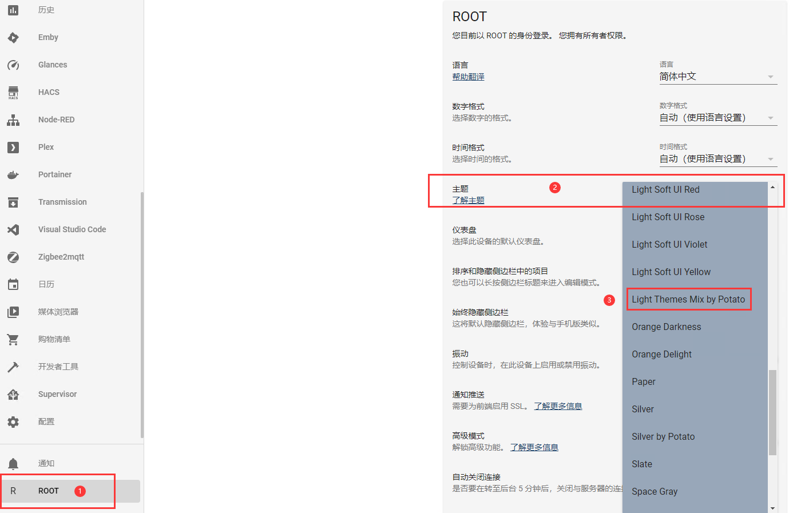

### **关于主题文件的使用说明**


适用于Homekit Infused主体框架的themes主题不是很多，常规下载的并不能拿来就用，修改一个看着没那么X冷淡的，使用方法：


1、下载放在对应的文件夹下（跟本仓库目录结构一样就行）

```
config/themes/
```


2、记得看一下`configuration.yaml`中有没有开启主题设置


```
frontend:
  themes: !include_dir_merge_named themes
```


3、服务器中重载一下配置


4、手动在用户面板中切换一下（或者在HKI主题配置中选择使用）。





`Neon.yaml`主题是源主题文件

`Light Themes Mix by Potato.yaml`可以用在HKI框架下（瞎改的）.

